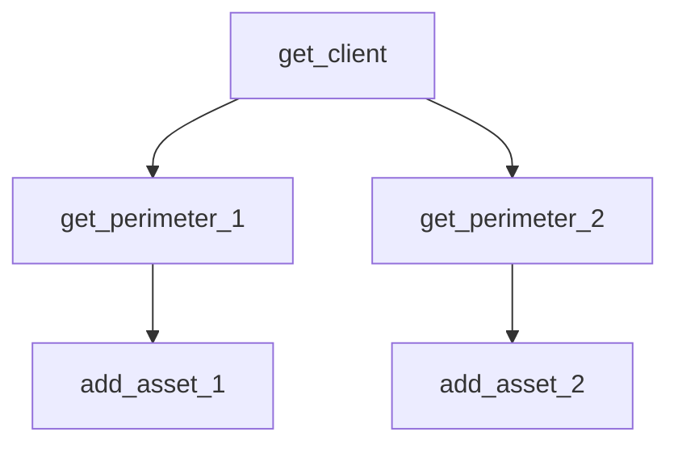

How Scouter Works ?
-

Scouter is a device and system archives, that store for some Perimeters a list of Assets and their Technos associated.

Client -(have some)-> Perimeters -(contains)-> Assets -(use)-> Technos


How the Pipeline Work ?
-
In order to make the code easier to use, i developped a pipeline system
The particularity is that the code remember your previous action, so in order of store Assets on 2 Perimeters from the same client, you can just get a ref of a client with `get_client`, then get the a ref of the first Perimeter with `get_perimeter`, then put your assets in it with `add_asset`, and now is the particularity, the Pipeline remember that you're in the client you get a ref of, so the `get_perimeter` will search through the client and to get a ref of your 2nd Perimeter you can just redo `get_perimeter`, with this your code run like a tree and make your code lighter.



Beside that, the pipeline have 2 Modes, `Plan` & `Execute`, the Plan mode do the modification in a local version of the remote database, you'll need first to be connected to the db to download it then, it will update your modification on the local one, you can sync it with the command `get_data`, and put a file name for the local db in json which by default is `const.json`, another option is the `nolog`, by default the Pipeline will log each action it does by a syntax similar to Terraform, you can desactivate it by using `nolog=True`


How to add code ?
-

The main construction of this program is based on the syntax, each function have an order and a name of data like this `<order>_<data>(*<params>)`, if i want to get a ref of a client which i only have the name i will write the following functions : `get_client({"name": "client_name"})`, this function will assign to the variable `client` the ref of the client found.

Exemple:

Let's suppose we want to get a ref of a device on an asset<br>
the code will look like this :

```py
from Assets.Assets import Asset
from typing import Union

def get_device(asset:'Asset', name:str) -> tuple[int, Union['Device', None]]:

    try:
        # -- Code to find the device with the name -- #
        return 1, Device()

    except:
        return 2, None
```

Like this, the device will be store in the pipeline and the error code too